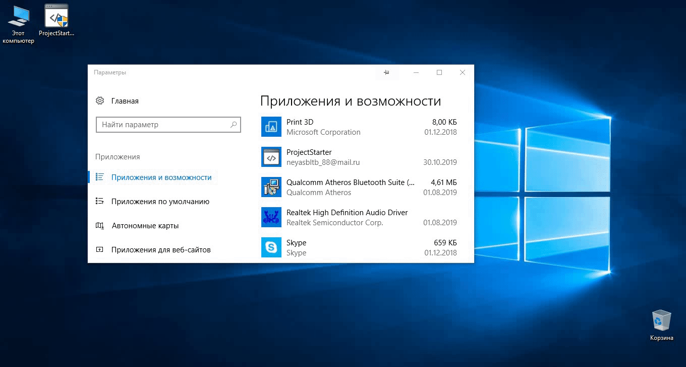

# ProjectStarter

Набор устанавливающихся скриптов .cmd в систему Windows, который добавляет в контекстное меню папок и рабочего стола новые пункты, при клике на которые будет запрос имени нового проекта и создастся соответствующая папка с базовой структурой web-проекта.

Установка ProjectStarter производится запуском [ProjectStarterInstall.exe](./ProjectStarterInstall.exe).

Удалить ProjectStarter возможно запуском [uninstall.cmd](./ProjectStarter/uninstall.cmd) из [папки с установочными файлами](./ProjectStarter/) или из окна "Удалить или изменить программу".

## Использование

ProjectStarter предусматривает 2 варианта проектов:

1. **Web**

    Простой Web-проект, состоящий из 3-х файлов: html, css, js. После создания структуры проекта, он открывается в редакторе [VS Code](https://code.visualstudio.com/).

    

2. **Webpack**

    Более продвинутая структура проекта на основе сборщика Webpack. Создается базовая структура папок проекта, файл конфигурации Webpack и прописываются зависимости в package.json. Затем инициализируется git-репозиторий и создается новый коммит "Init", после чего проект открывается в редакторе [VS Code](https://code.visualstudio.com/). Для начала работы необходимо установить зависимости командой `npm install` и запустить проект командой `npm run dev`. Запустится локальный сервер webpack-dev-server и в браузере откроется страница проекта.

    
